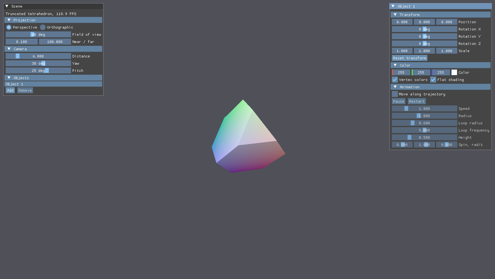
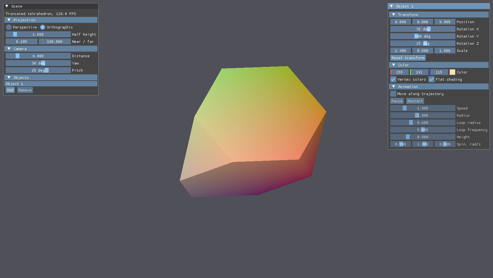
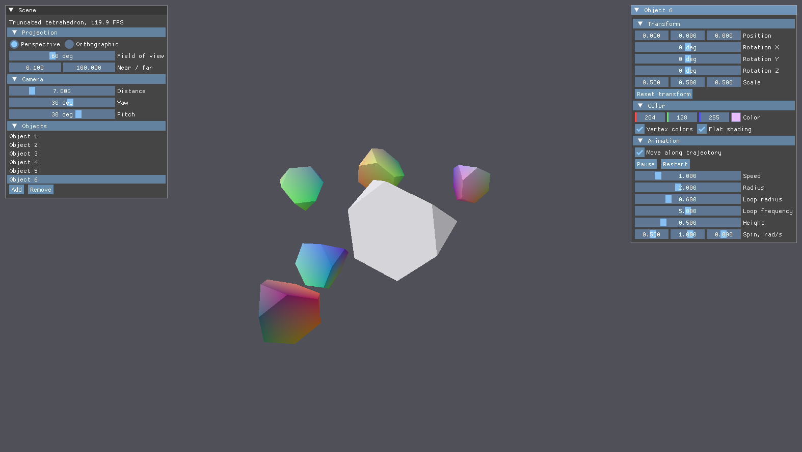

# Lab 1. 3D Graphics Basics: Truncated Tetrahedron

## Task

Render a 3D object in real time with Vulkan, GLFW and ImGui, project it onto the screen with
perspective and orthographic matrices and let the user change the projection and the affine
transformations of the object.
Variant 4: a truncated regular tetrahedron, whose faces are 4 regular triangles and 4 regular hexagons.

All six extra tasks are done:

1. Switching between orthographic and perspective projection in the interface.
2. Position, rotation and scale of the object in the interface.
3. Movement and rotation along a trajectory with play, pause, restart, speed and trajectory parameters.
4. Object color picker (`ColorEdit3`).
5. Procedural per-vertex colors from the local position, multiplied by the picked color.
6. Up to 8 objects, each with its own descriptor set (model matrix and color) next to a shared camera set.

## Build and run

```bash
cmake --preset mingw-debug
cmake --build build-debug --parallel
./build-debug/vulkan-starter-app
```

## Example

The `Scene` window on the left holds the scene settings, the window on the right edits the selected object.

```text
Projection   Perspective / Orthographic, field of view or half height, near and far planes
Camera       distance, yaw and pitch of the orbiting camera
Objects      list of objects, Add and Remove
Transform    position, rotation around X, Y and Z, scale
Color        color picker, vertex colors and flat shading on and off
Animation    move along trajectory, Play / Pause, Restart, speed, radius, loop radius,
             loop frequency, height, spin in rad/s
```





Reports: [Russian](report-ru.pdf), [English](report-en.pdf).

## Notes

The truncated tetrahedron is built from the regular tetrahedron with corners
$(1, 1, 1)$, $(1, -1, -1)$, $(-1, 1, -1)$, $(-1, -1, 1)$: every edge $A_iA_j$ is cut at one third,
which gives 12 vertices $P_{ij} = \frac{2A_i + A_j}{3}$, 18 edges and 8 faces ($V - E + F = 2$).
The vertices are normalized, so the object fits into the unit sphere.

Projection matrices target Vulkan clip space: $y$ points down and depth is in $[0, 1]$.
With $f = 1 / \tan(\text{fov}_y / 2)$ and aspect ratio $a$:

$$
P_{persp} =
\begin{pmatrix}
f/a & 0 & 0 & 0 \\
0 & -f & 0 & 0 \\
0 & 0 & \frac{far}{near - far} & \frac{near \cdot far}{near - far} \\
0 & 0 & -1 & 0
\end{pmatrix},
\qquad
P_{ortho} =
\begin{pmatrix}
\frac{1}{h a} & 0 & 0 & 0 \\
0 & -\frac{1}{h} & 0 & 0 \\
0 & 0 & \frac{1}{near - far} & \frac{near}{near - far} \\
0 & 0 & 0 & 1
\end{pmatrix}
$$

The model matrix is $M = T \cdot R_y \cdot R_x \cdot R_z \cdot S$, the trajectory is
$x = R\cos t + r\cos kt$, $y = H\sin 2t$, $z = R\sin t + r\sin kt$.

Flat shading takes the face normal as $\partial p / \partial x \times \partial p / \partial y$ of the
view-space position in the fragment shader and applies Lambert's law with a fixed light direction.

Fixes in the starter code: the main render pass got an external subpass dependency, which
removes the `SYNC-HAZARD-WRITE-AFTER-READ` reported by synchronization validation;
`submitAndPresent` no longer prints an error after every successful present; minimizing the window
no longer crashes the application, because frames are skipped while the framebuffer is empty and the
swapchain is rebuilt at the start of the next frame.
The application runs without validation messages with synchronization and best practices
validation enabled.
